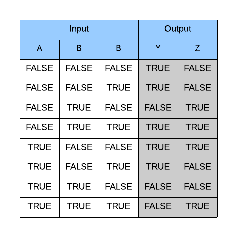

# Módulo 3
## Lógica Boleana

---
### Algebra Boleana

---
### Tablas de Verdad
Las tablas de verdad son una representación de las posibles entradas y salidas de un proceso. En una tabla de verdad, cada uno de los componentes debe ser representado en binario como TRUE o FALSE.

+++
### Tablas de Verdad

@snap[south span-100]
@css[text-white](Las salidas Y/Z dependen del contenido de las entradas ABC.)
@snapend

---
# Compuertas Lógicas

+++
# AND

+++
# OR

+++
# NOT

